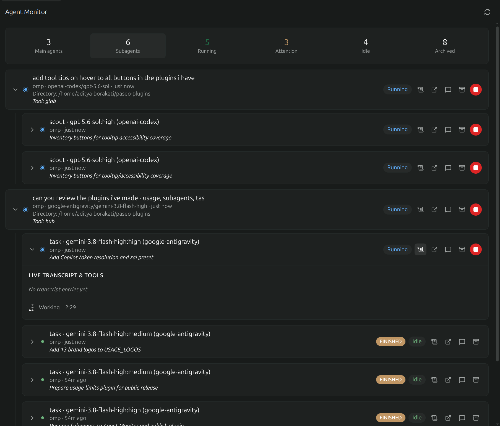

# workspace-activity

A Paseo plugin providing real-time workspace activity tracking with two primary panels: **Agent Monitor** and **Tasks**.

## Features

The plugin contributes two workspace surfaces accessible via the sidebar and explorer, as well as command center palette actions.

### 1. Agent Monitor



The Agent Monitor panel gives you full visibility and interactive control over every agent and subagent running in your workspace:

- **Hierarchical Agent Tree**: Visualizes parent-child agent relationships, nesting child subagents beneath their parent tasks. Displays summary counts across main agents, subagents, running agents, attention-required agents, idle agents, and archived agents.
- **Tool Call Inspection**: Inspect executed and in-flight tool calls in detail. Expand individual tool calls to view input arguments, execution outputs, and status badges.
- **Message Expansion**: Browse and expand transcript turns, assistant thoughts, and responses. Unfold earlier transcript history as needed.
- **Cancellation & Steering**: Send mid-turn steering prompts directly to agents, or stop a running turn. The agent stays alive and idle after a stop, so a later prompt resumes it.
- **Quick Navigation**: Open any agent session directly in a dedicated tab or toggle thread view inline.

### 2. Tasks


The Tasks panel provides real-time tracking of workspace todos and progress:

- **Real-Time Workspace Todo Tracking**: Aggregates todos and action items emitted across active agents in the current workspace.
- **Grouped by Agent**: Visualizes tasks categorized by agent with status metrics (completed vs total).
- **Status Filtering**: Filter tasks by status tabs: All, In Progress, Pending, and Completed.
- **Direct Navigation**: Jump directly to the relevant task context or agent thread from any task card.

## Install

> **Requires Paseo v0.8.0 or newer.**

Plugin code is trusted and unsandboxed. The server half runs in a subprocess with full access to the daemon machine. Read a plugin before you install it.

Make sure plugins are enabled first: **Settings > Plugins > Enable plugins** in the app, or `pluginsEnabled: true` in the daemon config. Then install straight from Git:

```bash
paseo plugin add ABorakati/paseo-workspace-activity
```

That clones the repository, compiles it on the daemon, and reaches **running** in `paseo plugin ls` with no package manager and no install scripts. Git installs track `main`; `paseo plugin status` shows when the upstream repository has moved and `paseo plugin update workspace-activity` pulls it.

### Find it

This plugin contributes workspace panels, not sidebar entries, because both views are scoped to the agents of one workspace. Open any workspace, then:

- **Workspace tab** — the tab picker lists **Agent Monitor** and **Tasks** alongside Terminal, Files and the other built-in tabs. Each opens as a full tab in the workspace.
- **Explorer panel** — the same two panels can be docked into the **Explorer** side panel so they stay visible beside an agent conversation.
- **Command palette** — `Open Agent Monitor`, `Open tasks`, and the `... in Explorer` variants of each.
- **Composer slash commands** — type `/tasks` or `/agents` in any workspace composer to open the matching panel without leaving your chat.

Both panels are empty until at least one agent has run in the workspace. Tasks fills in as soon as an agent emits a todo list; Agent Monitor lists every agent the workspace has ever had, including archived ones under the **Archived** filter.

### Install from source (development)

To work on the plugin itself, clone the checkout and register the directory instead, so the daemon runs your working tree:

```bash
git clone https://github.com/ABorakati/paseo-workspace-activity.git
cd paseo-workspace-activity
npm install && npm run typecheck
paseo plugin install .
```

`npm install` only fetches the type declarations used by `typecheck`; the daemon compiles the plugin itself and needs nothing from `node_modules`. If the plugin does not show as **running** within a few seconds, run `paseo daemon restart` and check again.

### After editing

`paseo plugin reload workspace-activity` (or **Reload** in Settings > Plugins) picks up edits to the plugin's own TypeScript.

## Documentation

Detailed guides live in [`docs/`](docs/):

- [Agent Monitor](docs/AGENT_MONITOR.md): the agent tree, filter tabs, tool call inspection, transcript expansion, steering, and cancellation.
- [Tasks](docs/TASKS.md): how todo snapshots are collected from agent timelines, grouped by agent, and filtered by status.
- [Architecture](docs/ARCHITECTURE.md): the client/server file split, the `cancelWorkspaceAgent` RPC and daemon session protocol, and agent navigation.

## Development

Install dependencies:

```bash
npm install
```

### Development Scripts

- **Typecheck**: Verify TypeScript types across the plugin:
  ```bash
  npm run typecheck
  ```
- **Lint**: Run oxlint for code style and correctness:
  ```bash
  npm run lint
  ```
- **Format Check**: Check code formatting:
  ```bash
  npm run format:check
  ```
- **Format**: Automatically format files with oxfmt:
  ```bash
  npm run format
  ```
- **Test**: Run the test suite using Vitest:
  ```bash
  npm run test
  ```

## License

[MIT](LICENSE) © 2026 Aditya Borakati
