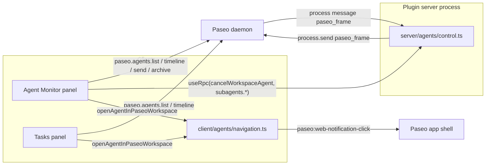

# Architecture

`workspace-activity` is a Paseo plugin with two UI panels and three server-side RPCs. This document explains how the files split between the client and the plugin server process, how the RPCs reach the daemon, and how the panels navigate the host application.

> **Requires Paseo v0.8.0 or newer.** The plugin uses the v0.8 runtime-entry layout (`index.client.tsx` / `index.server.ts`, `client/`, `server/`, `shared/`) introduced by the [plugin SDK migration](https://paseo.sh/docs/plugins/v0.8/migration).

## File map

| File                            | Runs in  | Role                                                                                                   |
| ------------------------------- | -------- | ------------------------------------------------------------------------------------------------------ |
| `index.client.tsx`              | Client   | Client entry. Registers workspace panels, command center items, and slash commands.                    |
| `index.server.ts`               | Server   | Server entry. Registers the three RPC handlers.                                                        |
| `shared/agents/control.ts`      | Both     | RPC contracts (`defineRpc` + zod schemas) shared by client and server.                                 |
| `server/agents/control.ts`      | Server   | RPC implementations that talk to the daemon over `process.send`.                                       |
| `client/agents/panel.tsx`       | Client   | Agent Monitor panel. See [AGENT_MONITOR.md](AGENT_MONITOR.md).                                         |
| `client/tasks/panel.tsx`        | Client   | Tasks panel. See [TASKS.md](TASKS.md).                                                                 |
| `client/agents/controls.tsx`    | Client   | Shared UI controls: status indicator, working indicator, action bar, steer composer.                   |
| `client/agents/navigation.ts`   | Client   | Opens an agent in a dedicated Paseo tab.                                                               |
| `client/ui/tooltip.tsx`         | Client   | `TooltipPressable`, a `Pressable` wrapper that adds a hover tooltip.                                   |
| `server/agents/control.test.ts` | Test     | Vitest coverage for the server RPC helpers against a fake daemon port.                                 |
| `client/index.client.test.ts`   | Test     | Vitest coverage for the client entry's panel, command center, and slash command registrations.         |
| `server/index.server.test.ts`   | Test     | Vitest coverage for the server entry's RPC handler registrations.                                      |
| `test/stubs/plugin-server.ts`   | Test     | Stub for the plugin SDK runtime specifiers so tests import the shared contracts without the SDK.       |
| `paseo-plugin.d.ts`             | Types    | Ambient declarations for `@getpaseo/plugin`, `@getpaseo/plugin/client`, and `@getpaseo/plugin/server`. |
| `paseo-plugin.json`             | Manifest | Plugin manifest read by `paseo plugin install`, including the `requirements.paseo` version gate.       |

## Client vs server split

Paseo loads a plugin in two places:

- **Client**: the Paseo app (web or native) renders panels with React Native primitives. Files under `client/` and `index.client.tsx` run here. They may import `react`, `react-native`, and `@getpaseo/plugin/client` / `@getpaseo/plugin/client/react-native` (`usePaseo`, `useRpc`, `Icon`, theme and layout types).
- **Server**: the daemon spawns a Node child process for the plugin. Files under `server/` and `index.server.ts` run here. They may use Node APIs (`node:crypto`, `process.send`, `process.on("message")`) and must not import React.
- **Shared**: files under `shared/` carry only data and contracts (zod schemas, `defineRpc` calls, TypeScript types). Both sides import them so the client's `useRpc(contract)` and the server's `server.handle(contract, handler)` agree on the wire shape.

`index.client.tsx` and `index.server.ts` each import only their own runtime's directory plus `shared/`. The compiler rejects a client file reaching into `server/` (and vice versa), so a client bundle never ships `server/agents/control.ts` and the server bundle never ships the panels.

Rules of thumb when adding code:

| Need                                                               | Put it in |
| ------------------------------------------------------------------ | --------- |
| React component or hook                                            | `client/` |
| Pure UI helper (colour math, formatting) used only by components   | `client/` |
| Anything that touches `process`, the filesystem, or Node built-ins | `server/` |
| Schema or type consumed by both sides                              | `shared/` |

A code module left at the plugin root, outside `client/`, `server/`, and `shared/`, is a compile error under v0.8.

## Registration (`index.client.tsx` / `index.server.ts`)

`contribute(server: PluginServerContext)` in `index.server.ts` runs once per load:

1. `server.handle(cancelWorkspaceAgent, cancelAgentTurn)` and the two subagent RPCs bind contract to handler.
2. Returns an empty disposer; the plugin holds no long-lived server resources.

`contribute(client: PluginClientContext)` in `index.client.tsx` runs once per connected client:

1. `client.addWorkspacePanel` registers `tasks`, `agent-monitor`, and `subagents` (a legacy alias for `agent-monitor` that renders the same component). All three use `context: "workspace"` and `locations: ["workspace", "explorer"]`.
2. `client.addCommandCenterItem` registers `open-tasks`, `open-tasks-explorer`, `open-agent-monitor`, and `open-agent-monitor-explorer`. Each `onSelect` calls `openPanel(id)` or `openPanel(id, { location: "explorer" })`.
3. `client.addSlashCommand` registers `/tasks` and `/agents`, each opening the matching panel from the composer.
4. Returns an empty disposer; the plugin holds no long-lived client resources.

## RPC layer

### Contracts (`shared/agents/control.ts`)

Three RPCs are defined with `defineRpc({ name, input, output })`:

| Contract                         | Name                                    | Input                                   | Output                                         |
| -------------------------------- | --------------------------------------- | --------------------------------------- | ---------------------------------------------- |
| `cancelWorkspaceAgent`           | `workspace-activity.agent.cancel`       | `{ agentId }`                           | `{ ok, error }`                                |
| `listWorkspaceProviderSubagents` | `workspace-activity.subagents.list`     | `{ parentAgentIds[] }`                  | `{ subagents: ProviderSubagentItem[] }`        |
| `getProviderSubagentTimeline`    | `workspace-activity.subagents.timeline` | `{ parentAgentId, subagentId, limit? }` | `{ entries: ProviderSubagentTimelineEntry[] }` |

`ProviderSubagentItem` describes a subagent the provider reports (id, parent, provider, title, description, subtitle, status, timestamps, optional `toolCallId` and `cwd`). Its `status` enum is `running | completed | failed | canceled`, which the Agent Monitor maps onto the Paseo lifecycle statuses.

### Why `cancelWorkspaceAgent` exists

The plugin SDK exposes `paseo.agents.ref(id).send(...)` and `.archive()` on the client, but no call to interrupt a running turn. The daemon does support interruption through its session protocol, and the plugin server process is connected to the daemon by a Node IPC channel. `cancelWorkspaceAgent` bridges the gap: the client asks the plugin server, and the plugin server speaks the daemon session protocol directly.

### Daemon port (`src/agents/control.server.ts`)

All three server handlers share one abstraction:

```ts
export interface AgentControlPort {
  send(frame: string): void;
  onMessage(handler: (message: unknown) => void): () => void;
}
```

`defaultPort` implements it on top of the IPC channel Paseo gives the plugin process:

- `send(frame)` calls `process.send({ type: "paseo_frame", data: frame, isBinary: false })`.
- `onMessage(handler)` attaches a `process.on("message", ...)` listener and returns the detach function.

Tests substitute a fake port (see `agent-control.test.ts`), so the request/response logic is exercised without a daemon.

### Request/response flow for cancellation

`createAgentCanceller(port, { timeoutMs = 10000, createRequestId })` returns `(agentId) => Promise<{ ok, error }>`. Each call:

1. Generates a request id (`wa-cancel-<uuid>`).
2. Subscribes to the port and filters frames: the envelope must be `{ type: "paseo_frame", isBinary: false, data: string }`; `data` is JSON. The parser accepts both `{ type: "session", message: { type, payload } }` and a bare `{ type, payload }`.
3. Starts a timeout that settles with `{ ok: false, error: "Timed out waiting for the daemon to cancel the agent" }`.
4. Sends the outbound frame:

```json
{
  "type": "session",
  "message": {
    "type": "cancel_agent_request",
    "agentId": "<agentId>",
    "requestId": "wa-cancel-<uuid>"
  }
}
```

5. Settles on the first matching reply (`payload.requestId === requestId`):
   - `cancel_agent_response` -> `{ ok: !error, error }`, where `error` is the daemon's refusal text (for example when no turn is running) or `null`.
   - `rpc_error` -> `{ ok: false, error }`.
6. Cleanup on settle: clears the timer and detaches the listener. A throw from `port.send` cleans up and rethrows.

The exported handler `cancelAgentTurn` wraps `defaultCanceller` and short-circuits with `{ ok: false, error: "Plugin process has no daemon channel" }` when `process.send` is missing (for example when run outside the daemon).

Cancellation interrupts the turn only. The agent stays alive and idle and a later prompt resumes it.

### Provider subagent RPCs

`createProviderSubagentLister` and `createProviderSubagentTimelineFetcher` follow the same pattern with different message types:

| Helper           | Request type                                                                                                                           | Response type                                                  | Timeout result |
| ---------------- | -------------------------------------------------------------------------------------------------------------------------------------- | -------------------------------------------------------------- | -------------- |
| Lister           | `agent.provider_subagents.list.request` (`parentAgentId`, `requestId`)                                                                 | `agent.provider_subagents.list.response` (`subagents[]`)       | `[]`           |
| Timeline fetcher | `agent.provider_subagents.timeline.get.request` (`parentAgentId`, `subagentId`, `direction: "tail"`, `limit` default 150, `requestId`) | `agent.provider_subagents.timeline.get.response` (`entries[]`) | `[]`           |

Both resolve to an empty array on timeout or send failure instead of rejecting, so a daemon without provider subagent support degrades to "no provider subagents" rather than an error banner. `listProviderSubagentsForParents` fans out one request per parent id with `Promise.all` and flattens the results.

### Client usage

Panels obtain a caller with `useRpc(contract)` from `@getpaseo/plugin/client`:

```ts
const cancelAgent = useRpc(cancelWorkspaceAgent);
const result = await cancelAgent({ agentId });
if (!result.ok) showError(result.error ?? "Failed to stop agent.");
```

The SDK serialises the input, routes the call to the plugin server by contract name, validates the output against the zod schema, and returns the parsed value.

## Data flow overview



Most reads go straight from the client to the daemon through the `usePaseo()` client (`paseo.agents.list`, `paseo.agents.ref(id).timeline.refetch`, `timeline.subscribe`, `agents.subscribe`, `send`, `archive`). Only operations the client SDK does not expose go through the plugin server RPCs.

## Navigation (`client/agents/navigation.ts`)

`openAgentInPaseoWorkspace(serverId, workspaceId, agentId)` opens an agent in a dedicated tab. Both panels call it with `host.id` as the server id. It works in two stages:

1. **Custom event**. If `globalThis.CustomEvent` and `globalThis.dispatchEvent` exist, it dispatches a cancelable `paseo:web-notification-click` event with `detail.data = { serverId, workspaceId, agentId }`. This is the same event the Paseo web shell listens for when a user clicks a browser notification, so the shell handles it by focusing the workspace and opening the agent tab. If a listener calls `preventDefault()` (the shell handled it), the function returns.
2. **Location fallback**. If the event was not handled (no listener, or a non-browser host), it navigates to `/h/<serverId>/workspace/<workspaceId>?open=agent:<agentId>` via `location.assign`, or by setting `location.href` when `assign` is unavailable. All ids are URL-encoded.

Both stages are wrapped in `try`/`catch` so headless or native environments without `CustomEvent` or `location` fail silently.

## Testing

`server/agents/control.test.ts` covers the server helpers with a `FakePort` that records sent frames and lets the test emit daemon replies. It asserts frame shapes, request id matching, timeout behaviour, listener cleanup, and the `cancelAgentTurn` guard for a missing `process.send`. `client/index.client.test.ts` and `server/index.server.test.ts` cover the v0.8 entry points' registration wiring. `vitest.config.ts` aliases the plugin SDK runtime specifiers to `test/stubs/plugin-server.ts` so tests load without the SDK.

Run with:

```bash
npm run test
```
