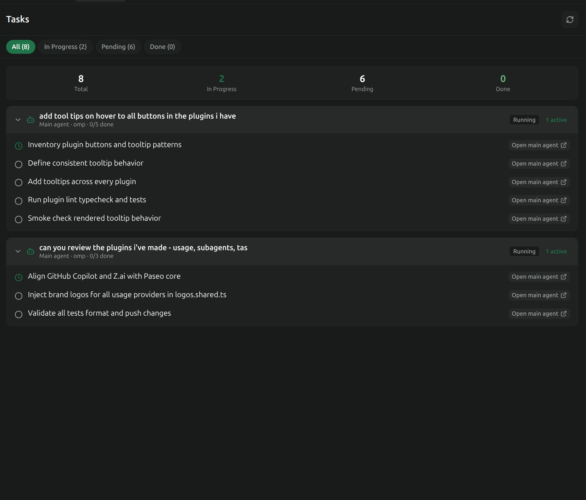

# Tasks



The Tasks panel shows the current todo list of every agent in the workspace, grouped by agent, with counts and a status filter. It reads the structured `todo` items that agents emit into their timelines; it does not maintain its own task store.

Source file: `src/tasks/panel.client.tsx` (`WorkspaceTasksPanel`, `WorkspaceTasksBody`, `extractLatestTodoSnapshot`, `TaskStatusIcon`).

## Opening the panel

The plugin registers the panel under the id `tasks` with the title "Tasks". Open it from:

- The workspace sidebar or the Explorer dock.
- Command center: **Open tasks** (`open-tasks`) or **Open tasks in Explorer** (`open-tasks-explorer`).

## Where tasks come from

Agents that keep a todo list (for example via a todo or plan tool) emit a timeline item of type `todo` each time the list changes. Each item carries the full list, not a delta:

```ts
{
  type: "todo",
  items: [
    { id: "1", text: "Read the tests", status: "completed", completed: true },
    { id: "2", text: "Implement parser", status: "in_progress", activeForm: "Implementing parser" },
    { id: "3", text: "Run typecheck", status: "pending" },
  ],
}
```

`extractLatestTodoSnapshot(items)` walks an agent's timeline from the newest entry backwards and returns the first `todo` item it finds. Older snapshots are ignored, so the panel always reflects the latest list. Each raw entry maps to a `TaskItemViewModel`:

| View model field | Source                                                                                                                         |
| ---------------- | ------------------------------------------------------------------------------------------------------------------------------ |
| `id`             | `t.id`, or `task-<index>-<first 16 chars of text>` when missing                                                                |
| `text`           | `t.text`, or `(empty task)`                                                                                                    |
| `status`         | `t.status` when it is `pending`, `in_progress`, or `completed`; otherwise `completed` if `t.completed` is true, else `pending` |
| `completed`      | `status === "completed"` or `t.completed`                                                                                      |
| `activeForm`     | `t.activeForm` (the present-participle label some agents attach to the active item)                                            |

An agent with no `todo` item in its recent timeline contributes an empty task list and is hidden from the grouped view.

## Aggregation and grouping

`fetchTasksForWorkspace` in `WorkspaceTasksBody` builds one `AgentTasksGroup` per agent:

1. Call `paseo.agents.list({ filter: { includeArchived: false }, page: { limit: 200 } })` and keep agents whose `workspaceId` matches the panel. Archived agents are excluded.
2. For every agent, refetch the last 200 projected timeline entries (`direction: "tail"`, `projection: "projected"`) and run `extractLatestTodoSnapshot`. A failed timeline fetch yields an empty list rather than an error.
3. Compute `counts` (`total`, `pending`, `inProgress`, `completed`) for the group.
4. Record `agentTitle` (falls back to `Agent <first 8 chars of id>`), `isMain` (no `paseo.parent-agent-id` label), `provider`, `status`, and `updatedAt`.
5. Sort groups: most in-progress tasks first, then most pending, then most recently updated.

The fetch runs on mount, on manual refresh, and on every `paseo.agents.subscribe` event debounced by 400 ms.

### Live updates

After the first load the panel subscribes to each group's timeline with `paseo.agents.ref(agentId).timeline.subscribe`. When a new `todo` item arrives for an agent, the panel replaces that group's `tasks` and `counts` in place and stamps `updatedAt` with the event timestamp. No full refetch is needed for a todo change; the subscription list is rebuilt whenever the set of groups changes.

## Status filter

The filter bar under the header is a tab list bound to `TaskStatusFilter`:

| Tab label       | Filter value  | Tasks shown                |
| --------------- | ------------- | -------------------------- |
| All (N)         | `all`         | Every task                 |
| In Progress (N) | `in_progress` | `status === "in_progress"` |
| Pending (N)     | `pending`     | `status === "pending"`     |
| Done (N)        | `completed`   | `status === "completed"`   |

The number in each label is the workspace-wide count for that status. `filteredGroups` applies the filter to each group's tasks and then drops groups whose filtered list is empty, so an agent disappears from the list when none of its tasks match.

The default filter is `all`.

## Layout

### Summary strip

When the workspace has at least one task, a four-cell summary shows Total, In Progress (accent colour), Pending, and Done (success colour). The strip reflects workspace totals regardless of the active filter.

### Agent card

One card per group in `filteredGroups`:

- **Header** (pressable): chevron, bot icon, agent title, then `Main agent | Subagent - <provider> - <completed>/<total> done`. On the right: a status badge with the agent's lifecycle status and, when `inProgress > 0`, an `N active` pill. Pressing the header collapses or expands the task list (`collapsedAgents`).
- **Task rows**: each task is a pressable row with a `TaskStatusIcon`, the task text (struck through when completed), the optional `activeForm` line, and an "Open main agent" / "Open subagent" link on the right.

`TaskStatusIcon` maps status to icon: `completed` -> `CheckCircle2` (success colour), `in_progress` -> `Clock` (accent), `pending` -> `Circle` (muted).

### Navigation

Pressing a task row calls `openAgentInPaseoWorkspace(host.id, workspaceId, agentId)` from `agent-navigation.client.ts`. This opens the owning agent in a dedicated Paseo tab so you can read the task in context. See [ARCHITECTURE.md](ARCHITECTURE.md) for how the navigation event is dispatched.

## Empty, loading, and error states

| Condition                                        | Title                      | Subtitle                                                            |
| ------------------------------------------------ | -------------------------- | ------------------------------------------------------------------- |
| First load in progress                           | Loading workspace tasks... | -                                                                   |
| `paseo.agents.list` failed and nothing is loaded | Error Loading Tasks        | The error message, plus a Retry button                              |
| No agents in the workspace                       | No agents in workspace     | Create an agent in this workspace to track automated todo progress. |
| Agents exist but none has a todo snapshot        | No task snapshots yet      | Agents will report structured todo items as they progress.          |
| Tasks exist but none match the filter            | No `<filter>` tasks        | Try selecting a different filter above to view other tasks.         |

The refresh button in the header (`RefreshCw`) triggers a full refetch and is disabled while a refresh is running.

## Limits

- The agent list is capped at 200 agents per fetch.
- Only the last 200 timeline entries per agent are scanned for a `todo` item. An agent whose most recent snapshot is older than that shows no tasks until it emits a new one.
- Archived agents never appear in the Tasks panel. Use the Agent Monitor's Archived tab to inspect them.
